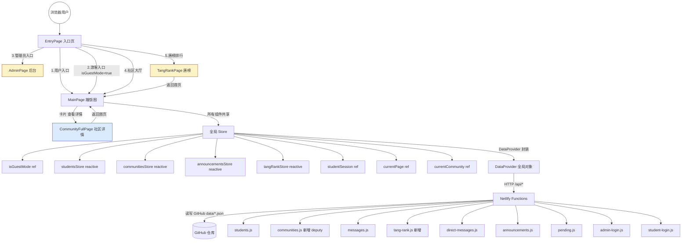
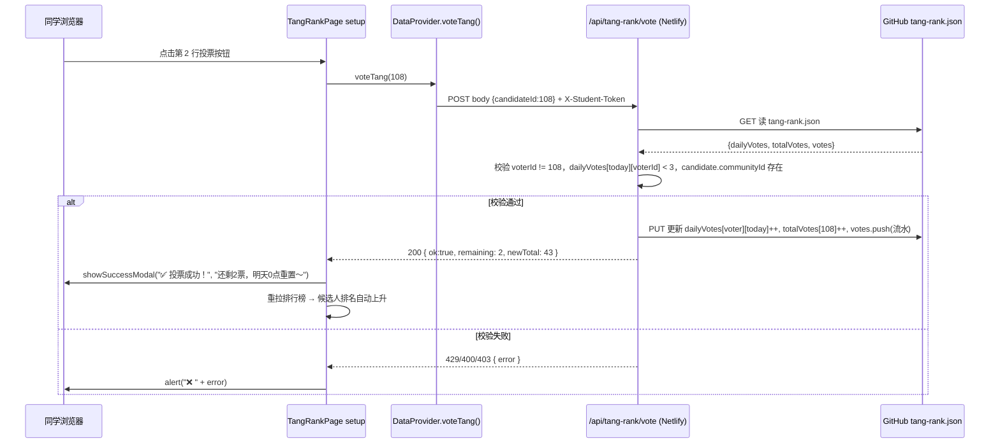

# V4 架构设计文档（DESIGN）

> 任务名：V4_唐榜游客社区升级
> 版本：v1.0
> 基于：CONSENSUS_V4升级.md

---

## 一、整体架构图



---

## 二、分层设计与核心组件

### 2.1 前端层（index.html 单文件 Vue）

#### 全局作用域新增（L1515 前后，靠近 studentSession 定义附近）

| 标识符 | 类型 | 作用 |
|---|---|---|
| `isGuestMode` | `ref(false)` | 游客模式开关，EntryPage 游客入口设 true，同学登录成功或管理员登录自动置 false |
| `currentCommunity` | `ref(null)` | 进入社区详情页时存社区对象，CommunityFullPage 读取 |
| `toInitials(name)` | `function` | 姓名 → 首字母（中文拼音首字母，无拼音库时 Unicode 模 26 回退） |
| `SuccessModal` 可复用片段 | `const successModalState = reactive({show, title, desc, onClose})` | 所有成功弹窗统一状态机，全局 showSuccessModal(title, desc) 函数触发 |

#### 组件分层

```
index.html
├── EntryPage (已存在，L2259)
│   └── 新增：第三个按钮「👁️ 游客入口」 + 一排两个小按钮（社区大厅/唐榜）
├── MainPage (已存在，L2345)
│   ├── 新增：MainPage 模板开头 v-if 显示「👥 游客模式」顶栏身份条
│   ├── 修改：7 处姓名渲染用 displayName(s) = isGuestMode ? toInitials(s.nickname) : s.nickname
│   ├── 修改：留言板输入框 + 社区申请按钮 disabled 分支
│   └── 新增：社区广场卡片「查看详情 →」跳转 CommunityFullPage
├── AdminPage (不变)
├── CommunityFullPage (新增，L≈3646 之后/AdminPage 之前)
│   ├── 4 个区块：Hero 头区 / 管理层 / 成员列表 / 角色操作区
│   └── setup：社长端设副社长弹窗 + 审批申请复用 joinReqsForAdminOrOwner
└── TangRankPage (新增)
    ├── 顶栏剩余票数徽章 / 规则卡 / 排行榜 table
    └── setup：拉 GET /api/tang-rank → 投票 POST /api/tang-rank/vote → 成功 SuccessModal
```

### 2.2 后端层（Netlify Functions）

#### 新增函数 tang-rank.js
- **GET /api/tang-rank**
  - Query: 无
  - 鉴权: X-Student-Token（可选，游客返回 rank，但 myRemaining=0）
  - 响应: `{ rank: [{studentId, nickname, initials, communityId, communityName, total, rank}], myRemaining, myVotedToday: [] }`
  - 流程：读 tang-rank.json → totalVotes 排序 → 如果有 Student Token → 当日 dailyVotes[date][studentId] 计算剩余 = 3 - 已用
- **POST /api/tang-rank/vote**
  - 路径: `/api/tang-rank/vote`（tang-rank.js 函数里用 `event.path.endsWith('/vote')` 判断）
  - Body: `{ candidateId }`
  - 鉴权: 必须 X-Student-Token → 解析后 voterId → 校验 voter.communityId 存在 → candidate 必须在 students 中且 communityId 存在 → voterId !== candidateId → dailyVotes[date][voterId] < 3
  - 成功: `{ ok: true, remaining: 2, newTotal: X }`
  - 失败: `4xx { error: 原因 }`
  - 写回: dailyVotes[date][voterId]++, totalVotes[candidateId]++, votes 追加流水

#### 修改 communities.js（副社长）
- **POST /api/communities/:id/deputy**
  - Path 正则提取 id，body `{ deputyOwnerId: number | null }`
  - 鉴权: verifyStudentAny → sess.student.id === community.ownerId（仅社长）
  - 校验: deputyOwnerId === null 或 deputyOwnerId ∈ community.memberIds
  - 成功: `{ ok: true, community }`
  - 写回: communities.json 更新 community.deputyOwnerId

---

## 三、模块依赖关系图（Mermaid）

```mermaid
graph TD
    A[DataProvider] -->|读/写| B1[students.json]
    A -->|读/写| B2[communities.json]
    A -->|读/写| B3[messages.json]
    A -->|读/写| B4[tang-rank.json NEW]
    A -->|读/写| B5[announcements.json]
    A -->|读/写| B6[pending.json]
    A -->|读/写| B7[direct-messages.json]
    A -->|读/写| B8[community-*-requests.json]

    C1[EntryPage] -->|调用| A
    C2[MainPage] -->|调用| A
    C3[CommunityFullPage] -->|调用| A
    C4[TangRankPage] -->|调用| A
    C5[AdminPage] -->|调用| A

    C2 -->|依赖| D1[isGuestMode]
    C3 -->|依赖| D2[currentCommunity]
    C1 -->|设置| D1
    C1 -->|跳转| C2 C3 C4

    C3 -->|复用| E1[joinReqsForAdminOrOwner computed]
    C2 -->|复用| E1

    C2 -->|emit navigate-community| C3
    C1 -->|emit navigate| C2 C4 C5
```

---

## 四、接口契约定义

### 4.1 前端 DataProvider 新增方法

| 方法 | 入参 | 返回 | 说明 |
|---|---|---|---|
| `setDeputyOwner(communityId, deputyOwnerId)` | `number, number \| null` | `Promise<{ok:true, community}>` | 设置/取消副社长 → POST /api/communities/:id/deputy |
| `getTangRank()` | 无 | `Promise<{rank, myRemaining, myVotedToday}>` | GET /api/tang-rank |
| `voteTang(candidateId)` | `number` | `Promise<{ok, remaining, newTotal}>` | POST /api/tang-rank/vote |
| `showSuccessModal(title, desc, autoCloseMs=3000)` | `string, string, number?` | 无 | 触发全局成功弹窗（响应式 successModalState 控制模板渲染） |

### 4.2 后端 HTTP 契约（新增）

#### 设置/取消副社长
```
POST /api/communities/{id}/deputy
Headers:
  Content-Type: application/json
  X-Student-Token: <同学登录Token>
Body:
  { "deputyOwnerId": 108 }       // 设置副社长 = 同学 108
  { "deputyOwnerId": null }      // 取消副社长
Response 200:
  { "ok": true, "community": { "id":.., "name":.., "deputyOwnerId": 108 } }
Response 403:
  { "error": "仅社长可设置副社长" }
Response 400:
  { "error": "候选人不是本社区成员" }
```

#### 获取唐榜
```
GET /api/tang-rank
Headers（可选）:
  X-Student-Token: <同学Token> → 有则返回 myRemaining / myVotedToday
Response 200:
  {
    "rank": [
      { "studentId": 108, "nickname": "王和成", "communityId": 1, "communityName": "吃鸡社", "total": 42, "rank": 1 }
    ],
    "myRemaining": 3,                 // 无 Token 或未入社 → 0
    "myVotedToday": [109, 131, 155]   // 今日已投哪些人（用于灰掉按钮）
  }
```

#### 投票
```
POST /api/tang-rank/vote
Headers:
  Content-Type: application/json
  X-Student-Token: <同学Token>
Body:
  { "candidateId": 108 }
Response 200:
  { "ok": true, "remaining": 2, "candidateId": 108, "newTotal": 43 }
Response 429:
  { "error": "今日 3 票已用完，明天 0 点再来～" }
Response 400:
  { "error": "不能投给自己哦" }
Response 403:
  { "error": "仅已加入社区的同学可参与投票" }
```

---

## 五、数据流向图

### 5.1 唐榜投票数据流


### 5.2 游客模式姓名首字母数据流
```mermaid
graph LR
    Store[isGuestMode ref] -->|reactive| C1[computed: displayNameFn(s) = isGuestMode ? toInitials(s.nickname) : s.nickname]
    C1 --> R1[左侧同学名录 render]
    C1 --> R2[地图 marker tooltip formatter]
    C1 --> R3[详情弹窗姓名]
    C1 --> R4[留言板气泡发送者]
    C1 --> R5[社区详情成员列表]
    C1 --> R6[唐榜排行榜姓名]
    C1 --> R7[社区广场创建者标签]
```

---

## 六、异常处理策略

### 6.1 前端异常
| 场景 | 策略 |
|---|---|
| 留言发送中重复点击 | `sending` ref + `:disabled="sending"` + 文案改为「发送中…」 |
| 投票中重复点击 | 同上 `voting` ref |
| 副社长设置失败 | alert 红错，回滚未提交 UI |
| 游客点击禁用操作 | 所有 disabled 控件加 `:title` tooltip 中文说明原因 |
| `toInitials` 空字符串或纯数字 | 返回原字符串首字符（不 crash） |

### 6.2 后端异常（tang-rank.js / communities.deputy）
| 场景 | 策略 |
|---|---|
| tang-rank.json 未初始化（null/undefined） | 启动时自动创建空结构 `{dailyVotes:{}, totalVotes:{}, votes:[]}` |
| 候选人 studentId 不存在 students.json | 400「候选人档案不存在」 |
| 候选人不在任何社区 | 403「候选人尚未加入社区，暂不上榜」 |
| dailyVotes[date] key 不存在 | 初始化为空对象，不 throw |
| 社群 deputyOwnerId 设为不在 memberIds 的 ID | 400「不能任命非本社区成员」 |
| 所有写操作双写失败 | 单个 JSON write 失败 → HTTP 500 返回 error，前端 alert |
