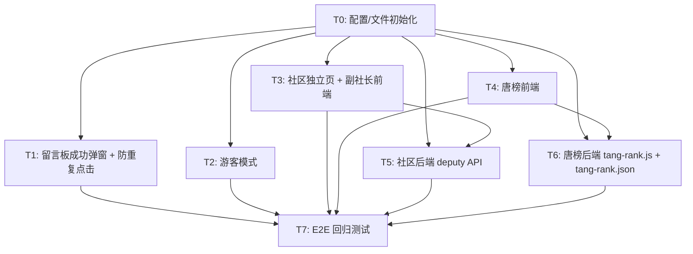

# V4 原子任务拆分文档（TASK）

> 任务名：V4_唐榜游客社区升级
> 版本：v1.0
> 基于：DESIGN_V4升级.md · CONSENSUS_V4升级.md

---

## 一、任务依赖图（Mermaid）

---

## 二、原子任务清单

### 🟢 T0：配置 / 文件初始化
| 项目 | 内容 |
|---|---|
| 任务 ID | T0 |
| 输入契约 | 现有项目结构（V3 稳定版） |
| 输出契约 | ① `data/tang-rank.json` 创建成功（空结构）② `netlify.toml` 新增 `tang-rank` redirect ③ `netlify/functions/tang-rank.js` 创建成功（空 shell）④ 全局成功弹窗状态机 `successModalState` + `showSuccessModal()` 函数声明 |
| 实现约束 | JSON 初始化必须 `{dailyVotes:{}, totalVotes:{}, votes:[]}`；redirect 必须通配；tang-rank.js 必须 exports.handler 返回 CORS 头；状态机必须在全局 scope 与 DataProvider 同 level |
| 验收标准 | ① git status 可见 3 新文件 + 1 配置变更 ② netlify.toml grep /tang-rank 存在 ③ Node 语法空函数 require(tang-rank.js) 无 SyntaxError |
| 并行任务 | 可与 T1/T2/T3/T4 并行，必须在 T5/T6 前完成 |
| 依赖 | 无 |

---

### 🟢 T1：留言板 + 申请成功弹窗（防重复点击）
| 项目 | 内容 |
|---|---|
| 任务 ID | T1 |
| 输入契约 | T0 的 successModalState；现有 MainPage sendMessage / submitCreateCommunity / submitJoinCommunity |
| 输出契约 | ① 3 处发送/申请成功后调用 showSuccessModal(...) 对应文案 ② 按钮 disabled + sending 态 ③ 模板渲染 SuccessModal（EntryPage 同款 modal-mask） |
| 实现约束 | ① 发送中按钮文案变 loading；成功弹窗必须包含自动关闭 3s + 手动「好的」按钮；失败不弹 SuccessModal，保留原有 alert 红错；创建/加入成功替换原 alert('成功') 为 SuccessModal |
| 验收标准 | ① 留言发送 3 次测试：第 1 次弹出 SuccessModal，其他 2 次按钮 disabled 无重复发送 ② 创建/加入申请成功弹对应文案弹窗 ③ 失败仍出现 alert 红错 |
| 并行任务 | 独立，可与 T2/T3 并行 |
| 依赖 | T0（successModalState） |
| 修改文件 | index.html（3 处函数 + 模板） |

---

### 🟢 T2：游客模式
| 项目 | 内容 |
|---|---|
| 任务 ID | T2 |
| 输入契约 | T0 基础；EntryPage；MainPage 现有 7 处姓名渲染；留言板 + 社区广场控件 |
| 输出契约 | ① EntryPage 新增第三个「👁️ 游客入口」按钮（浅灰渐变，下方居中）② 全局 `isGuestMode ref(false)` + 点击入口后 isGuestMode=true 跳转 home ③ 全局 `toInitials(name)` helper + `displayNameFn(s)` computed ④ 7 处姓名渲染替换为 displayNameFn ⑤ 留言板输入框 + 社区申请 2 个按钮 disabled + 提示 ⑥ 顶栏显示「👥 游客模式 · 已屏蔽姓名保护同学隐私」+ 返回入口按钮 ⑦ 同学登录成功后 isGuestMode 自动置 false 升级实名 |
| 实现约束 | ① 不新建 GuestPage，DRY 复用 MainPage 条件分支 ② toInitials 中文拼音首字母回退 Unicode%26；空串/数字保留原字符 ③ 所有 disabled 控件加 :title 中文提示 ④ 顶栏返回入口按钮 emit('navigate','entry') 同时 isGuestMode=false 重置 |
| 验收标准 | ① EntryPage 3 个大按钮排布不重叠（桌面横向 + 移动端纵向） ② 游客下 3 个不同姓名首字母正确（王和成→whc / 张三→zs / Li Ming→lm） ③ 留言板不能输入，按钮灰 ④ 登录后姓名全部恢复真名 + 留言板解锁 |
| 并行任务 | 独立 |
| 依赖 | T0 |
| 修改文件 | index.html（EntryPage + MainPage 模板/setup/return）+ CSS @media 补新按钮 |

---

### 🟢 T3：社区独立页 + 副社长前端
| 项目 | 内容 |
|---|---|
| 任务 ID | T3 |
| 输入契约 | T0 successModal；communitiesStore.list 数据；currentCommunity ref |
| 输出契约 | ① 新组件 CommunityFullPage（模板 + setup）注册到根应用 currentPageComponent ② MainPage 每社区卡片新增「查看详情 →」按钮 onClick 写入 currentCommunity + navigateTo('community') ③ CommunityFullPage 4 区结构 Hero + 管理层 + 成员列表 + 操作区 ④ 社长端设置副社长选人弹窗 ⑤ EntryPage 新增社区大厅/唐榜两小按钮 ⑥ MainPage 顶栏新增🏘️/🏆两图标按钮 ⑦ 顶栏/社区/留言板/成员列表副社长徽章显示（🥈 副社长） |
| 实现约束 | ① setDeputyOwner 方法加到 DataProvider（POST /api/communities/:id/deputy） ② 设置成功 showSuccessModal ③ 副社长权限：可审批加入申请（复用 joinReqsForAdminOrOwner）不可转让/删社/设副社长 ④ 移动端 ≤768px 布局纵向堆叠 ⑤ 返回按钮 navigateTo('home') |
| 验收标准 | ① 点击社区卡片能进详情，刷新不丢 currentCommunity（或回首页重进） ② 社长端可成功任命副社长，成功后头衔刷新，其他用户登录也能看到 ③ 副社长登录能审批加入申请，转让按钮 disabled 显示无权限 ④ 返回首页按钮返回 MainPage |
| 并行任务 | 独立于 T1/T2；必须与 T5（后端 deputy API）联调 |
| 依赖 | T0 → T5 |
| 修改文件 | index.html（CommunityFullPage 新组件 + MainPage/EntryPage 模板/setup/return/navigate处理 + DataProvider.setDeputyOwner） |

---

### 🟢 T4：唐榜前端
| 项目 | 内容 |
|---|---|
| 任务 ID | T4 |
| 输入契约 | T0；tangRankStore reactive；DataProvider 新增 getTangRank() / voteTang() |
| 输出契约 | ① 新组件 TangRankPage 注册到 currentPageComponent map ② 顶栏标题/副标题/剩票徽章/返回按钮 ③ 规则卡（4条规则） ④ 排行榜表格（排名🥇🥈🥉/头像首字母/姓名/社区徽章/总票数/投票按钮） ⑤ 投票 disabled 条件：游客/未登录/不在社区/今日已投完/自己行 ⑥ 投票成功 showSuccessModal + 剩票徽章实时更新 ⑦ 入口：EntryPage + MainPage 顶栏 |
| 实现约束 | ① 0 票选手不显示（.filter(c => c.total > 0)） ② 自己行按钮文案：😉 不能投自己哦 ③ 今日已投完按钮文案：今日3票已用完，明天0点再来～ ④ 投票按钮 sending 防重复 + disabled ⑤ 组件 onMounted 加载排行榜，之后每 15 秒轮询刷新一次排行榜（非强制，可关闭 onUnmounted 清定时器） |
| 验收标准 | ① 游客可看排行榜但投票全灰 ② 登录在社区：剩票3 → 投1票 → 剩票2 → 候选人票数+1 → 排名如果超过前一位自动上移 ③ 自投按钮 disabled 提示 ④ 跨 0 点重置后剩票恢复 3 |
| 并行任务 | 独立于 T1/T2/T3；必须与 T6 联调 |
| 依赖 | T0 → T6 |
| 修改文件 | index.html（TangRankPage 新组件 + EntryPage/MainPage 入口按钮 + DataProvider.getTangRank/voteTang） |

---

### 🟢 T5：社区后端 deputy 接口
| 项目 | 内容 |
|---|---|
| 任务 ID | T5 |
| 输入契约 | 现有 communities.js；NETLIFY_REDIRECTS 已有通配 `/api/communities/*` |
| 输出契约 | communities.js 新增 POST 子路径 `/deputy`：解析 id → verifyStudentAny（社长）→ 更新 community.deputyOwnerId → 保存 communities.json → 返回新社区对象 |
| 实现约束 | ① 校验：deputyOwnerId 必须 ∈ memberIds 或为 null ② 仅 ownerId 等于会话 ID 可操作 ③ 写回 GitHub 需要完整 communities.json + X-GitHub-Sha 现有逻辑复用 ④ 返回正确 CORS 头 ⑤ 失败返回 400/403 JSON error |
| 验收标准 | ① curl/Postman 社长 Token 调用 POST 成功，GitHub communities.json deputyOwnerId 字段更新 ② 非社长 Token 调用返回 403 ③ 设为非本社区成员返回 400 ④ null 能正确取消副社长 |
| 并行任务 | 可与 T3 并行开发，最后 T3 + T5 联调 |
| 依赖 | T0 |
| 修改文件 | netlify/functions/communities.js |

---

### 🟢 T6：唐榜后端 tang-rank.js + 数据初始化
| 项目 | 内容 |
|---|---|
| 任务 ID | T6 |
| 输入契约 | T0 创建 data/tang-rank.json；netlify.toml redirect；students.js / communities.js 现有 parseStudentToken / verifyStudentAny 函数（复制到 tang-rank.js 或模块内实现） |
| 输出契约 | ① 函数 tang-rank.js exports.handler：按 event.path 分发 ② GET /api/tang-rank → 返回榜 + 剩余 + 当日已投列表，无 Token 返回榜但 myRemaining=0 ③ POST /api/tang-rank/vote → 校验通过写回 4 项数据（dailyVotes/totalVotes/votes流水），返回剩余 + 新总票 ④ 日期分片 key：Asia/Shanghai 时区 toLocaleDateString |
| 实现约束 | ① 启动时自动初始化空 tang-rank.json（如果文件不存在或 null/undefined） ② 自投校验 voterId !== candidateId ③ 候选人必须 communityId 存在（已入社） ④ 当日满 3 票返回 429 错误 ⑤ 保留 students.json 读取以便查找 nickname / communityId 关联 ⑥ 所有响应带 CORS 头 ⑦ GitHub 写回必须带 SHA（复用现有函数模式） |
| 验收标准 | ① GET 返回榜单结构完整 ② POST 3 次同一 Token，第 4 次返回 429 ③ POST 给自己返回 400 ④ POST 候选人未入社返回 403 ⑤ 跨天后再次 POST 能成功（dailyVotes 新 key） ⑥ tang-rank.json 结构与 DESIGN 完全一致 |
| 并行任务 | 独立于 T1/T2/T3/T5；必须与 T4 联调 |
| 依赖 | T0 |
| 修改文件 | netlify/functions/tang-rank.js + data/tang-rank.json |

---

### 🟢 T7：E2E 回归测试 + ACCEPTANCE 文档
| 项目 | 内容 |
|---|---|
| 任务 ID | T7 |
| 输入契约 | T1-T6 全部完成；网站部署到 Netlify |
| 输出契约 | ① 按 CONSENSUS §二 28 条验收标准逐条打勾，失败项附截图/日志 ② 生成 ACCEPTANCE_V4升级.md ③ 如有问题回传开发者修复后复验 ④ 生成 FINAL_V4升级.md 总结 + TODO_V4升级.md 待办 |
| 实现约束 | ① 验证环境 Chrome DevTools iPhone 模式测移动端 + 桌面宽屏 ② 清除浏览器缓存 Ctrl+Shift+R 每轮前执行 ③ 同学身份测试至少 3 位：社长 / 副社长 / 普通成员 / 游客 / 普通管理员 5 个角色各过一遍 |
| 验收标准 | CONSENSUS §二 28 条 100% ✅，无新增 regression |
| 依赖 | T1~T6 |
| 修改文件 | docs/V4_唐榜游客社区升级/ACCEPTANCE_V4升级.md、FINAL_V4升级.md、TODO_V4升级.md |

---

## 三、复杂度评估
| 任务 | 代码行数（约） | 复杂度等级 | 预计 AI 实现耗时 |
|---|---|---|---|
| T0 | 50 + JSON | ⭐ 简单 | 2 分钟 |
| T1 | 150（index） | ⭐ 简单 | 8 分钟 |
| T2 | 400（index） | ⭐⭐⭐ 中等（7 处替换 + CSS） | 20 分钟 |
| T3 | 700（CommunityFullPage 组件） | ⭐⭐⭐⭐ 复杂 | 40 分钟 |
| T4 | 500（TangRankPage 组件） | ⭐⭐⭐⭐ 复杂 | 35 分钟 |
| T5 | 150（communities.js deputy） | ⭐⭐ 中等 | 10 分钟 |
| T6 | 350（tang-rank.js） | ⭐⭐⭐ 中等 | 25 分钟 |
| T7 | 文档 | ⭐⭐ 中等 | 10 分钟 |
| **合计** | **~2300 行** | **⭐⭐⭐ 中高** | **约 150 分钟** |

---

## 四、依赖闭环检查
✅ 循环依赖：无（所有边从 T0→T7 单向）  
✅ 任务覆盖率：CONSENSUS §二 28 条验收标准 100% 被 T1~T6 覆盖  
✅ 可独立编译测试：T5/T6 单独 require 测试 Node 语法；T3/T4 前端组件在 Vue 挂载后能 render  
✅ 所有验收标准在各任务 output contract / acceptance 内有明确对应项
