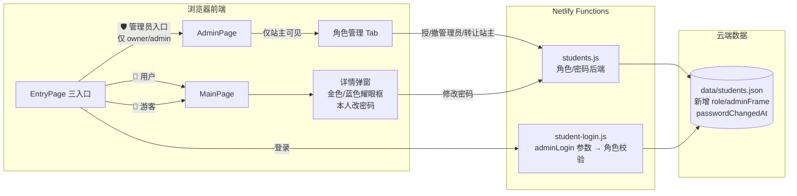
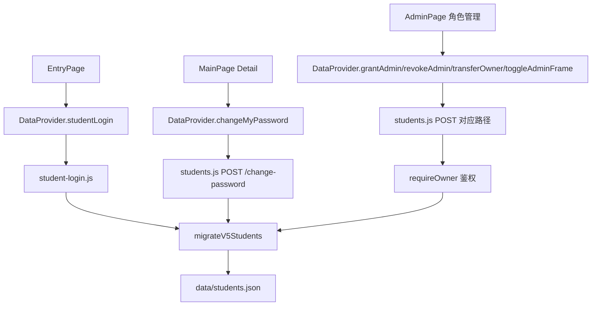

# V5_站主管理员角色升级 · 设计文档（DESIGN_V5升级.md）

> 6A 工作流 · 阶段 2 Architect
> 最后更新：2026-07-30

---

## 一、整体架构图



## 二、分层设计和核心组件

| 层 | 组件 | 职责 |
|---|---|---|
| 入口层 | EntryPage | 三入口 UI + 管理员/用户登录弹窗 + 游客态进入 |
| 展示层 | MainPage Detail 弹窗 | 站主金色框 / 管理员蓝色框 + 本人密码修改 |
| 管理后台层 | AdminPage · 角色管理 Tab | 站主授/撤管理员 · 转让站主 · adminFrame 开关 |
| API 层 | DataProvider JS 类 | changeMyPassword / grantAdmin / revokeAdmin / transferOwner / toggleAdminFrame |
| 鉴权层 | authStudentContext (students.js) | requireLogin / requireOwner / requireAdmin 中间件 |
| 数据层 | migrateV5Students() | 自动补 role/adminFrame/password/passwordChangedAt 四个字段 |

## 三、模块依赖关系



## 四、接口契约定义

### 4.1 登录接口（student-login.js）
```json
POST /api/student-login
Body: { "name": "王鹤澄", "password": "123456wHc", "adminLogin": true }
Response 200:
  { "ok": true,
    "token": "...signed...",
    "student": { "id":"xxx", "nickname":"王鹤澄", "role":"owner", "passwordChangedAt":null, ... },
    "isOwner": true, "isAdmin": true }
Response 403:  // adminLogin=true 但角色不是 owner/admin
  { "error": "你不是管理员/站主，无权从「管理员入口」登录" }
```

### 4.2 授/撤管理员 + 转让（students.js）
```
POST /api/students/:id/grant-admin   → body: {} → 需 owner
POST /api/students/:id/revoke-admin  → body: {} → 需 owner
POST /api/students/:id/transfer-owner→ body: {} → 需 owner
POST /api/students/:id/toggle-admin-frame → body: { enable: true/false } → 需 owner
POST /api/students/:id/change-password → body: { oldPassword, newPassword } → 需本人登录 + passwordChangedAt 为空
```

### 4.3 同学数据字段（V5 新增 4 个）
```ts
interface Student {
  // === 已有字段 ===
  id: string; nickname: string; province: string; city: string; university: string; ...
  // === V5 新增 ===
  role: 'owner' | 'admin' | 'student';       // 角色
  adminFrame: boolean;                        // 管理员蓝色耀眼框（独立于头衔）
  password: string;                           // 登录密码（默认：owner 123456wHc，其他人 123456）
  passwordChangedAt: number | null;           // 密码修改 1 次时间戳（ms），null 未改
}
```

## 五、数据流向图

```mermaid
sequenceDiagram
  participant O as 站主(Owner)
  participant FE as AdminPage·角色管理 Tab
  participant BE as students.js
  participant DB as data/students.json

  O->>FE: 点「授予 A 同学管理员」
  FE->>BE: POST /api/students/A-id/grant-admin (X-Student-Token: owner's)
  BE->>BE: requireOwner 校验
  BE->>DB: A.role = admin; A.adminFrame = true
  DB-->>BE: OK
  BE-->>FE: { ok: true, student: {...A...} }
  FE-->>O: 绿色成功弹层 + A 那行立即变管理员
```

## 六、异常处理策略

| 异常场景 | 处理方式 |
|---|---|
| 普通同学用管理员入口登录 | student-login 返回 403 → 前端红色「你不是管理员/站主」 |
| 管理员越权调用 grant-admin | students.js requireOwner → 401 + 前端 alert |
| 转让站主目标不存在 | 后端 404「未找到该同学」，前端回滚 |
| 修改密码时原密码错 | students.js 400 + 前端红色提示 |
| 修改密码第二次调用 | passwordChangedAt ≠ null → 400「仅允许修改一次」 |
| GITHUB_TOKEN 读写失败 | 沿用现有重试 3 次 + 红框报错 + 回滚 UI 勾选 |
| 忘记 owner 密码 | 入口页「🔧 超级管理员密码登录（备用）」兜底（admin-login.js） |
