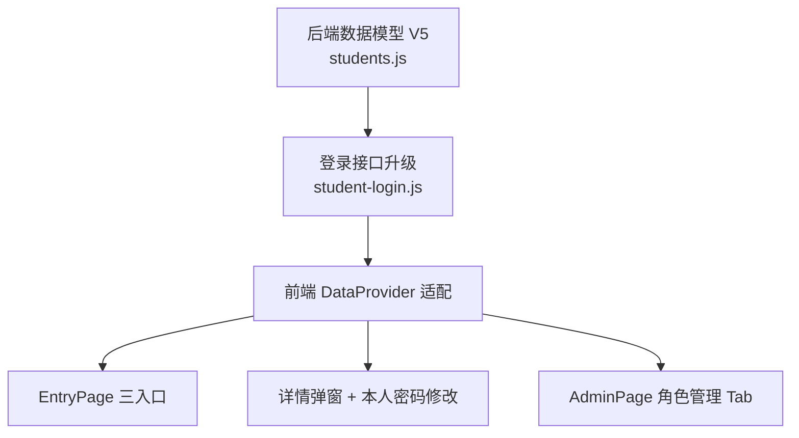

# V5_站主管理员角色升级 · 原子任务（TASK_V5升级.md）

> 6A 工作流 · 阶段 3 Atomize
> 最后更新：2026-07-30

---

## 一、子任务拆分

### 任务 A · 数据模型升级 (students.js)
- **输入契约**：现有 data/students.json（旧格式，无 role/adminFrame）
- **输出契约**：GET /api/students 自动返回带 V5 字段的新数组；所有角色变更接口返回 200 + {ok,student}
- **实现约束**：
  - 新增 migrateV5Students()：给每条记录补 role/adminFrame/password/passwordChangedAt 四个字段
  - "王鹤澄"精确匹配 → role=owner，密码默认 123456wHc
  - 其他同学 role=student，密码默认 123456
  - 新增 authStudentContext → requireOwner / requireAdmin / requireLogin
  - 新增 5 个 POST 接口：grant-admin / revoke-admin / transfer-owner / toggle-admin-frame / change-password
- **依赖**：无（纯后端改造，可独立测试）
- **验收标准**：直接 GET /api/students → 每条记录都有四个新字段，王鹤澄是 owner

### 任务 B · 登录接口升级 (student-login.js)
- **输入契约**：POST body { name, password, adminLogin?: boolean }
- **输出契约**：adminLogin=true 时非 owner/admin → 403 + error；成功时 token 中带 role/isOwner/isAdmin
- **实现约束**：同 V4 的双端校验（姓名≥2字、密码≥4位、姓名存在、密码正确）
- **依赖**：任务 A（因为需要 role 字段）
- **验收标准**：同学 A 用 adminLogin=true → 403；管理员/站主 → 200 带 token

### 任务 C · 前端 DataProvider 适配
- **输入契约**：后端 V5 接口
- **输出契约**：新增 DataProvider.changeMyPassword(old, new) / grantAdmin(id) / revokeAdmin(id) / transferOwner(id) / toggleAdminFrame(id, enable)
- **实现约束**：失败时 throw，不吞错误；changeMyPassword 返回 {ok, passwordChangedAt}
- **依赖**：B（登录后 token 结构）
- **验收标准**：浏览器控制台调用各方法返回正确结构

### 任务 D · EntryPage 三入口
- **输入契约**：用户进入 / 路由为 entry
- **输出契约**：三个按钮（👥用户/🛡️管理员/👀游客）+ 两套登录弹窗（用户/管理员）
- **实现约束**：管理员登录后直接 navigate('admin')；用户登录 navigate('home')；游客设 isGuestMode=true
- **依赖**：C（需要 studentLogin(adminLogin: true/false)）
- **验收标准**：三入口均能正常登录/进入

### 任务 E · 详情弹窗 + 本人密码修改 (MainPage)
- **输入契约**：点击同学卡片 → 弹窗
- **输出契约**：站主金色框；adminFrame 管理员蓝色框；本人查看时 🔐 我的账户 → 密码修改弹窗（仅 1 次）
- **实现约束**：detailTitleWrapClass/Style 响应 role/adminFrame；passwordChangedAt 非空禁用修改
- **依赖**：C（changeMyPassword 接口）
- **验收标准**：本人修改密码成功 → 再点修改按钮消失 → 刷新页面修改按钮确实仍不显示

### 任务 F · AdminPage 角色管理 Tab（仅站主可见）
- **输入契约**：站主登录后台 → 角色管理 Tab
- **输出契约**：搜索 + 身份筛选 + 每行 授/撤管理员 + adminFrame 开关 + 转让站主确认弹窗
- **实现约束**：tabs 必须是 computed（动态），amIOwner=false 时 roles Tab 不存在
- **依赖**：C（grantAdmin/revokeAdmin/transferOwner/toggleAdminFrame）
- **验收标准**：站主可见 Tab，授/撤管理员立即生效；转让后原站主 Tab 消失

---

## 二、任务依赖图



---

## 三、每个原子任务的验收
```
A → curl -X GET /api/students | head -c 500  → 看到 role/adminFrame/password
B → curl -X POST /api/student-login adminLogin=true → 角色校验
C → 浏览器 DevTools 手调 DataProvider.* 方法 → 返回结构正确
D → 入口页 3 个按钮都点一遍 → 都能进
E → 自己的档案 → 改密码 → 成功后按钮消失
F → 站主登录 → 角色管理 Tab → 授/撤/转让走一遍
```

## 四、复杂度评估

| 任务 | 复杂度 | 备注 |
|---|---|---|
| A | 中 | 需要设计迁移函数和鉴权中间件 |
| B | 低 | 主要是加 adminLogin 参数判断 |
| C | 低 | 加 5 个 DataProvider 方法 |
| D | 中 | 模板字符串长，易出格式问题（历史踩坑点） |
| E | 中 | 详情弹窗要改很多地方 + 密码修改 UI/UX |
| F | 高 | 模板+逻辑都多，转让的二次弹窗要稳 |
