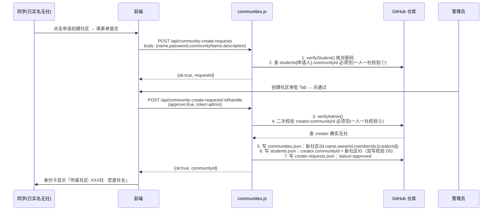
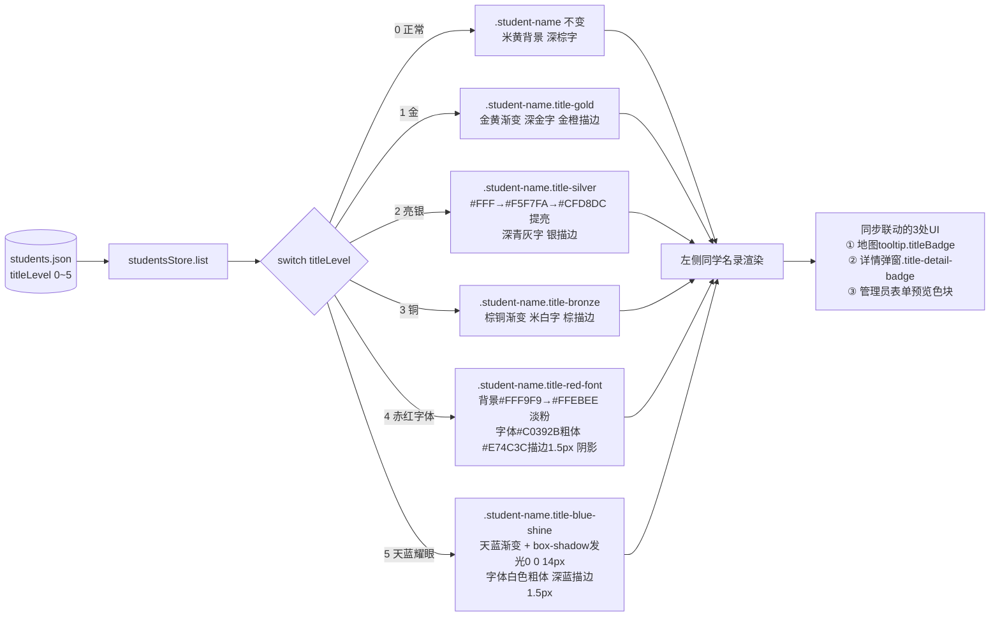
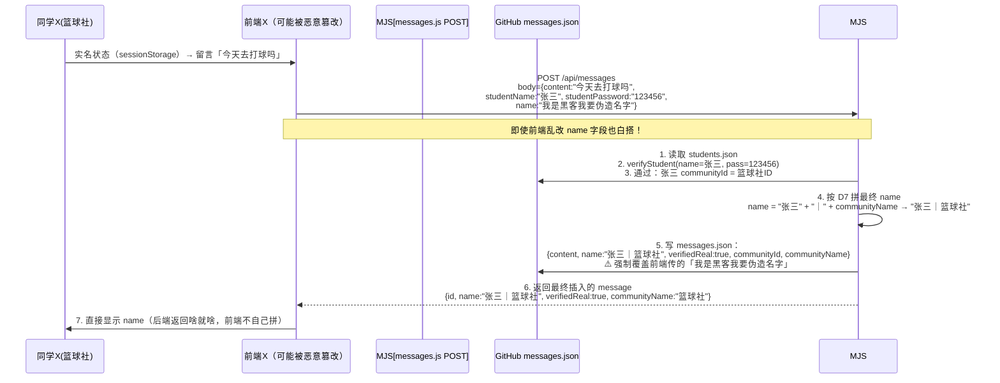

# DESIGN_社区密码升级 v1.0

> 版本：v1.0（2026-07-29）
> 输入：CONSENSUS_社区密码升级 v1.0
> 输出：系统分层 + 5 张架构图（mermaid）+ 接口实现细则 + 异常处理策略

---

## 1. 整体架构分层图

```mermaid
flowchart TB
    subgraph 浏览器前端[前端 index.html - Vue3 CDN 单文件]
        direction TB
        U1[身份会话 sessionStorage<br>cengfan.student.session]
        U2[页面组件<br>HomePage / AdminPage / MessagePage]
        U3[UI 组件<br>身份卡片 / 社长面板 / 密码管理 Tab / 社区 Tab]
        U4[轮询层 Poller(5s)<br>6 个 Store 的 refreshAll()]
        U5[DataProvider<br>fetchWithRetry(3次)<br>永不降级本地存储]
    end

    subgraph CDN边缘[Netlify CDN 边缘层]
        R1[Redirects netlify.toml<br>/api/* → /.netlify/functions/*]
    end

    subgraph 函数后端[Netlify Functions - 纯函数 Node 18 LTS]
        direction TB
        F1[student-login.js<br>S1 S2 身份/会话校验]
        F2[students.js 扩展<br>ST1/ST2/ST3 + password生成]
        F3[messages.js 扩展<br>留言板后端校验+拼name]
        F4[communities.js 新增<br>C1~C7 社区CRUD/审批/转让]
        F5[direct-messages.js 新增<br>DM1~DM3 单聊列表/发送/已读]
        F0[公共工具代码 inline<br>headers / verifyAdmin / verifyStudent<br>githubRequest / getFileContent / writeFileContent<br>toBeijingTime / random6Digits / fetchWithRetry]
    end

    subgraph 存储层[GitHub 仓库 JSON 文件存储]
        direction TB
        D1[data/students.json<br>新增 password / communityId]
        D2[data/communities.json<br>新增 4 字段: ownerId/memberIds/status]
        D3[data/community-create-requests.json<br>全新]
        D4[data/community-join-requests.json<br>全新]
        D5[data/direct-messages.json<br>全新]
        D6[data/messages.json<br>新增 verifiedReal/communityId/communityName]
        D7[data/pending.json / data/announcements.json<br>不变]
    end

    subgraph 环境变量[Netlify Environment Variables - 密钥层]
        EV1[GITHUB_TOKEN]
        EV2[GITHUB_REPO]
        EV3[GITHUB_BRANCH = main]
        EV4[ADMIN_PASSWORD]
    end

    U5 --> R1
    R1 --> F1 & F2 & F3 & F4 & F5
    F0 --> EV1 & EV2 & EV3 & EV4
    F1 & F2 & F3 & F4 & F5 --> F0
    F0 --> D1 & D2 & D3 & D4 & D5 & D6 & D7
```

---

## 2. 前端模块依赖与响应式关系图

```mermaid
flowchart LR
    subgraph 响应式核心[Vue3 reactive/ref 内存态]
        S1[studentsStore<br>list + titleLevel + password + communityId]
        S2[communitiesStore<br>list + createRequests + joinRequests]
        S3[messagesStore<br>list + verifiedReal + communityName]
        S4[directMsgsStore<br>conversations by studentId + unread]
        S5[announcementsStore / pendingStore / adminStore<br>不变]
        S6[studentSession<br>loggedIn/studentId/nickname/communityId/password]
    end

    subgraph 触发源[操作触发点]
        T1[同学身份验证<br>studentName + password → S1]
        T2[社长面板<br>审批加入 / 转让社长]
        T3[同学端<br>创建社申请 / 加入社申请 / 发单聊 / 退出社]
        T4[管理员后台 7+3 Tab<br>密码管理 / 创建社审批 / 社区管理 / 加入社审批 / 单聊收件箱]
        T5[轮询定时器 every 5s<br>refreshAll(S1..S6)]
    end

    subgraph UI订阅器[页面和组件 computed]
        P1[主页身份卡<br>显示 S6.nickname + password + 所属社区]
        P2[主页社区信息卡<br>社区列表 + 申请创建/加入按钮]
        P3[留言板消息列表<br>按后端返回 name 渲染 + 实名/社区徽章]
        P4[同学名录<br>按 titleLevel 0-5 渲染 6 档姓名框]
        P5[管理员 Tab 4-8<br>密码表 / 审批表 / 会话列表]
    end

    T1 & T2 & T3 & T4 --> S1 & S2 & S3 & S4 & S6
    T5 --> S1 & S2 & S3 & S4
    S1 & S2 & S3 & S4 & S5 & S6 --> P1 & P2 & P3 & P4 & P5
```

---

## 3. 社区状态机与数据流（一人一社双写）

### 3.1 创建社区 & 审批数据流



### 3.2 加入社区 & 社长审批数据流

```mermaid
sequenceDiagram
    participant 同学B as 同学B(实名无社)
    participant 社长A as 社长A(篮球社)
    后端C[communities.js]
    仓[GitHub JSON]

    同学B->>后端C: POST /api/community-join-requests<br>{name,password,communityId}
    后端C->>仓: verifyStudent()<br>一人一社校验③: student.communityId 必须空
    后端C-->>同学B: {ok:true, requestId}

    社长A->>后端C: GET /api/communities → 查 joinRequests 我的社=pending
    社长A->>后端C: POST /api/community-join-requests/:id/handle<br>{approve:true,社长自己的name+password}
    后端C->>仓: 1. verifyStudent(社长A)<br>2. 二次校验 申请人B.communityId === 空 (一人一社校验④)<br>3. 校验 社长A === communities[].ownerId
    后端C->>仓: 4. memberIds.push(B.id)<br>5. studentB.communityId = communityId<br>6. joinRequest.status=approved
    后端C-->>社长A: {ok:true}
    仓-->>同学B: 轮询5秒拉到 student.communityId 变化
    同学B->>同学B: 身份卡片刷新 → 显示所属社区
```

---

## 4. 色号级联渲染数据流



---

## 5. 留言板实名 + 社区显示数据流（防绕过核心）



---

## 6. 模块实现细则（前端 + 后端）

### 6.1 前端新增模块清单（index.html 内）

| 模块 | 位置 | 功能 |
|---|---|---|
| ① `studentSession` reactive | `<script>` 顶部 DataProvider 前 | 登录态内存对象：`loggedIn/studentId/nickname/password/communityId/communityName/isOwner` |
| ② StudentAuth 组件 | HomePage 顶部横幅下方（紧接 announcement-banner）| 「身份验证」区：未登录→姓名+密码输入；已登录→绿色身份卡片（姓名+密码+社区+退出）|
| ③ StudentOwnerPanel 弹窗 | 身份卡下方（仅 isOwner=true 时显示入口）| 社长面板：成员列表、待审批加入、转让社长 |
| ④ CommunityCard info-card | 右栏 info-card 第 5 张（并列公告/留言板/聊天板/身份卡）| 社区列表 + 申请创建/加入两个按钮 |
| ⑤ StudentDirectChat 弹窗 | 身份卡下方（实名后显示入口「💬 联系管理员」）| 单聊历史消息 + 输入框 |
| ⑥ Admin 3 个新 Tab | AdminPage `tabs` 数组扩 9 项：`密码管理(4)/创建社审批(5)/社区管理(6)/加入社审批(7)/单聊收件箱(8)` |  |
| ⑦ Password Reset 按钮 | Tab4 每行最后一列「重置密码」+ 顶部「批量补全空密码」 |  |
| ⑧ 6 档色号 CSS 替换 | `.student-name.title-silver` 旧样式覆盖 + `.title-red-font` 和 `.title-blue-shine` 新增 2 套 |  |

### 6.2 后端新增/扩展 functions

| 文件 | 类型 | 路由条数 | 新增工具函数 |
|---|---|---|---|
| `student-login.js` | 新增 | 2（S1/S2）| `verifyStudentByNickname(name, pass)` → return student or null |
| `students.js` | 扩展 | 加 3（ST1/ST2/ST3）| `random6Digits()` 生成 6 位纯数字；`ensurePassword(student)` 保证有密码 |
| `messages.js` | 扩展 | 改 POST（M4-1）| 复用 `verifyStudentByNickname`（和 student-login.js 同一份 copy）|
| `communities.js` | 新增 | 7（C1~C7）| `getStudent(id)`、`isOwner(studentId, community)`、`dualWriteMember(studentId, communityId, 'add'/'remove')`（双写校验）|
| `direct-messages.js` | 新增 | 3（DM1~DM3）| `groupConversationsByStudent(list)`（管理员视角的会话聚合）|

> **代码复用策略**：5 个 functions 现在都独立 copy `verifyAdmin / githubRequest / getFileContent / writeFileContent / toBeijingTime`（和旧的 5 个保持一致），不抽公共 util 文件（避免 Netlify Functions 的相对路径 require 出路径问题，保持现有项目 5 个文件的模式，虽然重复但稳定）。

### 6.3 netlify.toml 重定向新增 8 条

```toml
[[redirects]]
  from = "/api/student-login"
  to = "/.netlify/functions/student-login"
  status = 200
[[redirects]]
  from = "/api/student-verify-session"
  to = "/.netlify/functions/student-login"
  status = 200
[[redirects]]
  from = "/api/students/batch-fill-passwords"
  to = "/.netlify/functions/students"
  status = 200
[[redirects]]
  from = "/api/students/*/reset-password"
  to = "/.netlify/functions/students"
  status = 200
[[redirects]]
  from = "/api/students/*/leave-community"
  to = "/.netlify/functions/students"
  status = 200
[[redirects]]
  from = "/api/communities"
  to = "/.netlify/functions/communities"
  status = 200
[[redirects]]
  from = "/api/communities/*"
  to = "/.netlify/functions/communities"
  status = 200
[[redirects]]
  from = "/api/direct-messages"
  to = "/.netlify/functions/direct-messages"
  status = 200
[[redirects]]
  from = "/api/direct-messages/*"
  to = "/.netlify/functions/direct-messages"
  status = 200
# /api/community-create-requests、/api/community-join-requests 都走 communities.js（靠 path 判断）
[[redirects]]
  from = "/api/community-create-requests"
  to = "/.netlify/functions/communities"
  status = 200
[[redirects]]
  from = "/api/community-create-requests/*"
  to = "/.netlify/functions/communities"
  status = 200
[[redirects]]
  from = "/api/community-join-requests"
  to = "/.netlify/functions/communities"
  status = 200
[[redirects]]
  from = "/api/community-join-requests/*"
  to = "/.netlify/functions/communities"
  status = 200
```

> 路由到同一个 function（如 community-create-requests 和 community-join-requests 都走 communities.js）时，function 内部用 `event.path` 开头判断走哪段逻辑，和现在 students.js 里 `if (event.httpMethod === 'PUT')` 同理。

---

## 7. 异常处理策略（共 10 类）

| 异常编号 | 场景 | 处理方式（前端 + 后端）|
|---|---|---|
| E1 | 密码生成碰撞（概率极低：1000 个学生时碰撞概率约 0.05%）| 后端 `random6Digits()` 生成后，遍历当前 students.list 查重；如重复重新生成，最多重试 5 次；5 次都重 → 升级为 7 位数字（防死循环）|
| E2 | 同学重置密码后旧 session 仍然有效（安全风险）| 每次刷新页面前端都调 `S2 verify-session` 核对 studentId 当前密码和 session 时的一致吗；不一致就清 sessionStorage 并弹提示「管理员已重置您的密码，请重新验证」|
| E3 | 并发加入审批导致「一人多社」（两个社的社长同时点同意同一个人）| 后端 `dualWriteMember` 加二次校验：写之前再查一次 student.communityId 必须空；非空 → 报错「你已加入其他社」，写文件整体回滚不提交 |
| E4 | GitHub JSON 文件上传时 SHA 冲突（写入时别人刚改了同一个文件）| 复用现有 `fetchWithRetry(3次)` + SHA 重新获取：第 1 次 sha 冲突 → `getFileContent()` 重新拉最新 sha → `writeFileContent()` 再写 1 次；3 次都失败 → 返回给前端「网络繁忙，请 10 秒后重试」 |
| E5 | 社长转让的目标同学不是本社成员 | 后端 `C6 transfer-owner` 校验：`newOwnerId in community.memberIds`；不在 → 报错「只能转让给本社成员」；前端在社长面板的下拉框里直接**只显示本社成员**（软限制）|
| E6 | 同学身份验证时姓名匹配失败（重名同学）| ⚠️ 这是现有数据模型隐患：`students.json` 里 `nickname` 不是唯一！**解决**：verifyStudent 时找所有 nickname===输入姓名的，逐一试密码；有一个密码匹配就算通过并返回对应 student；全失败才报 401；管理员端提示「姓名重复的同学，请设置不重复的昵称」+ 新增档案时检查 nickname 重复提示 |
| E7 | 社区名称重复（两个创建申请都叫「篮球社」）| 创建审批通过时后端检查：`communities[] 中 status='active' 且 name 相同` → 有则拒绝并提示「已有同名社区，请换名字或联系管理员删除旧社」|
| E8 | 留言板 SQL 注入（不是 SQL，但防 JSON 注入）| 所有字段内容都 `JSON.parse(event.body)` 走结构化解析；content 字段最大 200 字符；`<script>` 标签在前端渲染时默认使用 Vue `{{ }}` 插值（自动转义 HTML）不使用 v-html，因此天然 XSS 安全 |
| E9 | 单聊消息超过 500 条上限 | 每次 DM2 POST 前检查：`studentId` 的消息数 ≥ 500 → 先 `splice(0, oldestCount)` 砍最老的到 450 条，再 push 新的；前端提示「该会话已满 500 条，已自动清理最早 50 条」|
| E10 | 社长退出社时误触发未转让校验 | 后端：`studentId == ownerId` 且 memberIds.length > 1 → 必须先转让；但如果社只剩自己（memberIds=[ownerId]）→ 允许直接退出（退社后社区没成员但保留数据，管理员可以删除该社），提示「您是最后一个成员，退出后该社将为空，需管理员删除」|

---

## 8. 设计可行性验证（质量门控自评）

| 质量门控项 | 是否通过 | 验证说明 |
|---|---|---|
| 架构图清晰准确 | ✅ | 5 张 mermaid 覆盖分层/模块依赖/社区/色号/留言板防绕过 5 大核心流程 |
| 接口定义完整 14 条 | ✅ | CONSENSUS §3 精确到入参出参 |
| 与现有系统无冲突 | ✅ | 旧 students/pending/announcements 字段不变；titleLevel 0-3 原样；functions 结构和现有 5 个一致（重复 util 代码）|
| 安全边界清晰 | ✅ | 同学端 10 条异常处理覆盖核心风险；留言板后端强制拼 name 防绕过；密码 session 每次刷新核对 |
| 数据一致性（一人一社双写）| ✅ | 写文件前二次校验 + 3 处接口硬限制 + 前端软限制，三重保护 |
| 移动端适配 | ✅ | 所有新组件都加 @media，横向滚动不会出现；顶部公告横幅换行逻辑保持不变 |
| Netlify Functions 路由正确 | ✅ | 新增的 13 条 redirects 明确；所有路由 path 都通过 `event.path` 在 function 内部 switch，不依赖文件名自动匹配 |
| 4 个新增 JSON 空数组初始值 | ✅ | 上传 GitHub 后 functions 首次 getFileContent 会正确返回 `[]` 空数组，不会 JSON.parse 报错 |
